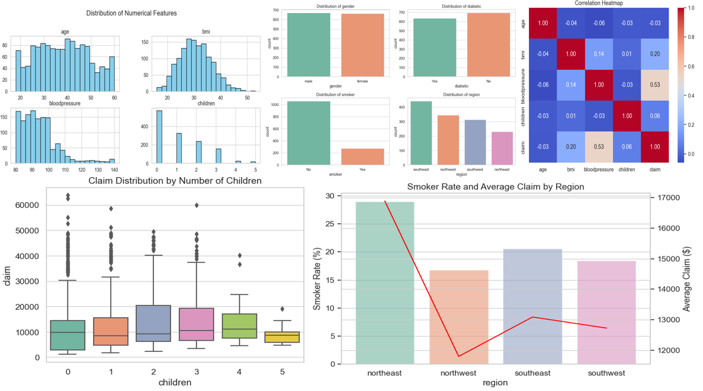
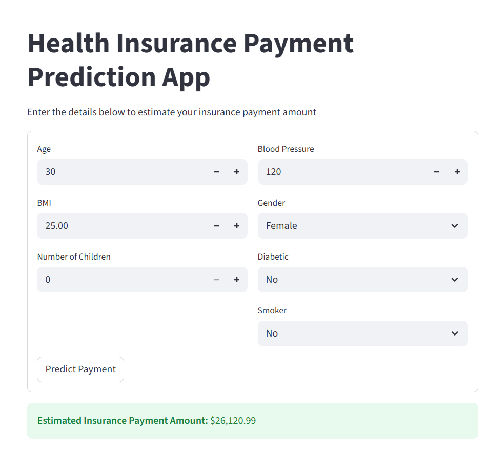

# 🏥 Health Insurance Payment Prediction

A machine learning project that predicts **health insurance payment costs** based on personal and health-related attributes.  
The project includes **data analysis, model training**, and a **Streamlit web application** for interactive prediction.

---

## 📌 Project Overview

Health insurance costs depend on multiple factors such as age, BMI, blood pressure, smoking habits, and medical conditions.  
This project applies **machine learning regression models** to estimate insurance payment amounts and deploys the best model as a **web app**.

---

## 🚀 Features

- 📊 Exploratory Data Analysis (EDA)
- 🧠 Machine Learning model training & evaluation
- ⚙️ Feature scaling and preprocessing
- 🏆 Best model selection
- 🌐 Interactive Streamlit web application
- 💰 Real-time insurance payment prediction

---

## Exploratory Data Analysis (EDA)



---

## Web Application Interface


---

## ▶️ How to Run the Project

### 1️⃣ Clone the repository
```bash
git clone https://github.com/ducthinh503/health-insurance-prediction.git
cd health-insurance-prediction
```
### 2️⃣ Install dependencies
```bash
pip install -r requirements.txt
```
### 3️⃣ Run the Streamlit app
```bash
streamlit run app.py
```
### 4️⃣ Open in browser
```bash
http://localhost:8501
```
---

## 🗂️ Project Structure

```bash
health-insurance-prediction/
│
├── app.py                    # Streamlit application
├── requirements.txt          # Project dependencies
│
├── analysis_model.ipynb      # Data analysis & visualization
├── modeling.ipynb            # Model training & evaluation
│
├── models/
│   ├── scaler.pkl            # Trained feature scaler
│   └── best_model.pkl        # Best trained ML model
│
└── README.md                 # Project documentation
